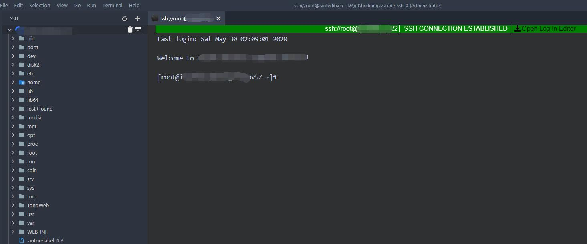

# SSH Client For Visual Studio Code



## Features

- Save SSH configurations
- Convenient SSH terminal connections
- SFTP file operations
- **Export/Import connections in XML format**

## Usage

### Basic Connection Management
1. Open SSH view from the activity bar
2. Click the "Add Connection" button to create new SSH connections
3. Configure your connection details (host, port, username, password or private key)

### Export/Import Connections

#### Export Connections
1. Click the "Export Connections" button in the SSH view
2. Choose a location to save the XML file
3. All your current SSH connections will be exported with:
   - Passwords encoded in base64 for security
   - Private key paths preserved as-is
   - Connection algorithms and settings included

#### Import Connections
1. Click the "Import Connections" button in the SSH view
2. Select an XML file containing SSH connections
3. Confirm the import operation
4. Connections will be merged with existing ones (duplicates will be overwritten)

#### XML Format
The exported XML file follows this structure:
```xml
<?xml version="1.0" encoding="UTF-8"?>
<ssh-connections>
  <connection id="username@host:port">
    <name>Connection Name</name>
    <host>hostname</host>
    <port>22</port>
    <username>username</username>
    <password encoding="base64">base64encodedpassword</password>
    <private-key-path>/path/to/private/key</private-key-path>
    <passphrase encoding="base64">base64encodedpassphrase</passphrase>
    <algorithms>
      <cipher>
        <algorithm>aes256-ctr</algorithm>
      </cipher>
    </algorithms>
  </connection>
</ssh-connections>
```

**Note**: Passwords and passphrases are base64 encoded for security, while private key paths are stored as-is to maintain file system references.
